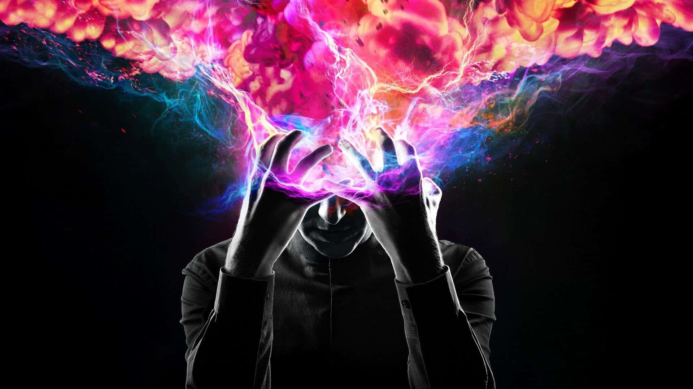

  

<h1 align="center">Vishnu R K</h1>

  Software Engineer · AI Systems · Distributed Systems

  <a href="https://linkedin.com/in/vishnu-kumar-620a14184">LinkedIn</a>
  ·
  <a href="mailto:vrk800@gmail.com">Email</a>

---

### About

Software engineer with 6 years of experience building distributed systems and cloud applications at Adobe.

Currently focused on **AI engineering**, with an interest in agentic systems, LLM applications, RAG, MCP and reliable AI infrastructure.

My foundation is in **software engineering, distributed systems and AWS**, and I enjoy applying that foundation to emerging AI systems.

---

### Focus

`AI / LLMs` · `Agentic Systems` · `RAG` · `MCP`

`Distributed Systems` · `AWS` · `Serverless` · `Event-Driven Architecture`

`Python` · `TypeScript` · `Node.js` · `React`

---

### Selected Work

**Agentic AI Configuration Platform**
Natural-language interface for contact-center configuration using LLM tool calling, MCP and layered validation.

**Tool-Calling Agent Loop**
A production-oriented agent loop built directly on an LLM API, exploring tool execution, concurrency, structured outputs and evaluation.

**RAG Pipeline**
Retrieval system focused on measuring and diagnosing retrieval quality rather than treating RAG as simple vector search.

---

### Experience

**Adobe** · Computer Scientist
2020 — Present

Building cloud-native systems and AI-powered tooling for large-scale customer-service workflows.

---

### Beyond Code

Travel · Photography · Side projects

  Build things. Understand how they work. Keep learning.

